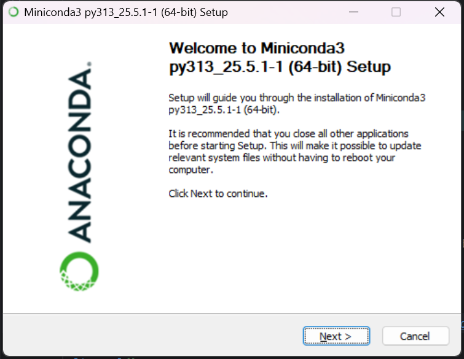
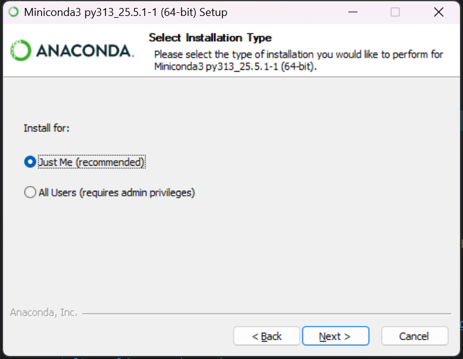
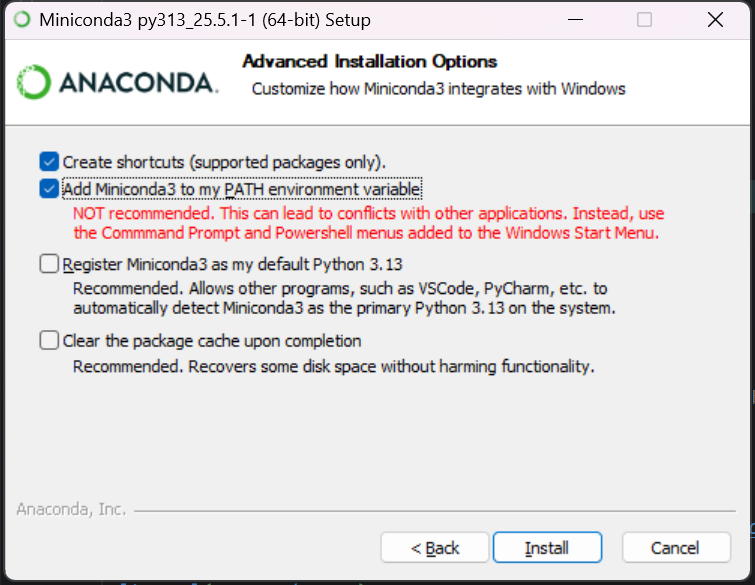

# QLiteBot


一个基于[NcatBot](https://github.com/liyihao1110/ncatbot)开发的轻量化新手友好qq bot项目

## 项目简介

这是一个轻量化的qq bot项目，帮助你在短时间内将llm以qq bot的形式接入群聊和群友聊天

因为这个项目是从一个较大项目中分离出来的，懒得删了，所以保留了 llm运行python代码 的功能，虽然看起来这对于一个qq bot来说是多余的

## 注意事项

1.该项目目前只支持单次接入一个群聊

2.部署前需要安装最新版[qq](https://im.qq.com/index/)

## 部署步骤

### 1.克隆仓库到本地

```bash
cd 你想要部署该项目的目录
git clone https://github.com/jdnoeg/QLiteBot
cd QLiteBot
```

### 2.安装环境

该项目可以使用任何虚拟环境部署，会部署环境的可以自行进行这一步，不会的可以参考

此处使用conda进行部署

从[anaconda](https://repo.anaconda.com/miniconda/Miniconda3-latest-Windows-x86_64.exe)官网下载miniconda安装包并运行



到这一步选择Just Me(recommended)



这一步的时候一定要勾选Add Miniconda3 to my PATH environment variable！！！



点击安装，等待完成安装后退出安装程序

### 3.配置环境

```bash
conda create python=3.11 -n QLiteBot -y
conda activate QLiteBot
pip install -r requirements.txt
```

### 4.填写配置文件

使用你的记事本或其他编辑器打开config.py，在对应位置根据注释提示填写你的相关配置

llm中是你的llm（语言模型）参数，vml中是你的vlm（视觉模型）参数

该项目可以使用所有OpenAI支持的API

**注意：** 不要修改功能提示词，这将会影响项目的核心功能

### 5.运行主程序

```bash
conda activate QLiteBot
python main_response.py
```

第一次运行时ncatbot会自动运行安装程序，按照程序中的步骤安装napcat及ncatbot即可

第一次运行时需要手机使用bot的账号扫码登录

### 6.当你想关闭bot时

在程序运行的窗口中使用快捷键ctrl+C即可安全退出程序，此时qq bot的账号将下线

## 互动指南

当你在一条消息中@了你的bot，它将会对这条消息做出响应

你可以在消息中加入图片，bot的vlm（视觉模型）将会识别图片消息并进行响应

bot可以收到带有引用的消息，可以引用一条普通消息、带图片的消息或一整段合并转发的聊天记录

程序会每十分钟检查一次历史消息记录并删除多余的旧聊天记录，保留300条

bot上线前所有的聊天记录都不会在bot的聊天历史中，对所有不在聊天历史中的消息进行的引用bot都不会收到，默认按照普通消息处理


正如简介所说，bot可以在部署的主机上运行python代码实现一些功能，比如获取天气、时间，你可以主动要求它这样做，不过安全性无法保证
